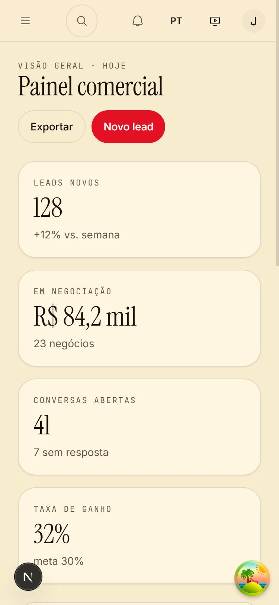
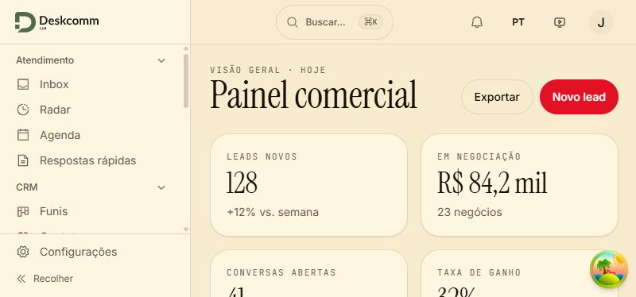
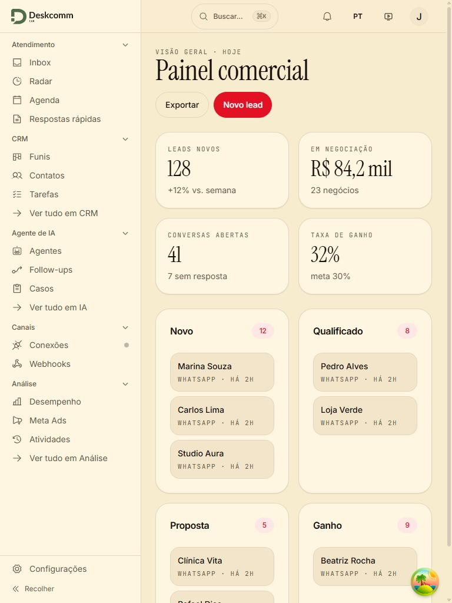
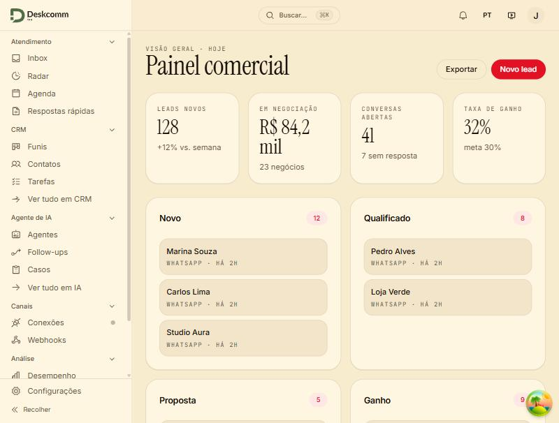

# Visual Mission Control no MasterCloudCRM — prova pela tela

Capturas de 2026-10-04, servidor de desenvolvimento local, sidebar + barra superior + cards
reais do CRM com dados fictícios (as telas autenticadas precisam de um Supabase).

| Imagem | Viewport |
|---|---|
|  | celular em pé, 375×812 |
|  | celular deitado, 812×375 |
|  | tablet em pé, 768×1024 |
|  | tablet deitado, 1024×768 |

Origem do visual: o painel `PainelAdminGeral` (Mission Control) — paleta creme/tinta/brasa,
Instrument Serif + Inter + JetBrains Mono. Ver `app/globals.css` e `docs/brand/README.md`.
